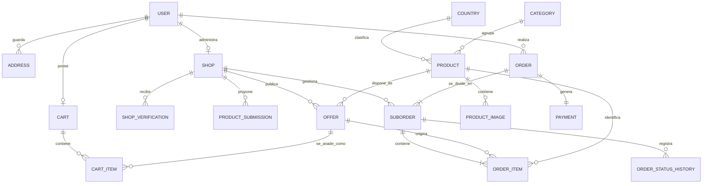

# Modelo conceptual de datos — DeMiTierra

## 1. Objetivo

Este documento define el modelo conceptual de datos de DeMiTierra.

Su finalidad es identificar las principales entidades del sistema, sus responsabilidades y las relaciones existentes entre ellas antes de implementar el modelo físico en PostgreSQL.

El diseño debe permitir representar:

* Usuarios con diferentes roles.
* Registro y verificación de comercios.
* Catálogo de productos maestros.
* Ofertas de varios comercios para un mismo producto.
* Moderación administrativa.
* Carritos.
* Pedidos divididos por comercio.
* Seguimiento del estado de cada subpedido.
* Pagos simulados.
* Conservación del histórico de precios y estados.

## 2. Principios del modelo

### 2.1. Separación entre producto y oferta

Un producto maestro contiene información común:

* Nombre.
* Marca.
* País de origen.
* Categoría.
* Formato.
* Descripción.
* Imágenes.

Una oferta contiene información específica de un comercio:

* Comercio vendedor.
* Precio.
* Stock.
* Coste de envío.
* Tiempo estimado de entrega.
* Disponibilidad.

Por tanto, un producto maestro podrá tener múltiples ofertas.

### 2.2. Los comercios requieren aprobación

Crear una cuenta no autoriza automáticamente a vender.

Un comercio deberá superar un proceso de verificación antes de:

* Proponer productos.
* Crear ofertas.
* Recibir pedidos.

### 2.3. Los precios históricos no deben cambiar

El precio de una oferta puede modificarse con el tiempo.

Sin embargo, un pedido debe conservar los valores existentes en el momento de la compra:

* Precio base.
* Comisión.
* Precio final.
* Cantidad.
* Coste de envío.

Por este motivo, los artículos del pedido almacenarán una copia de esos valores y no dependerán del precio actual de la oferta.

### 2.4. Cada comercio gestiona su propio envío

Un pedido puede contener productos de diferentes comercios.

El sistema creará:

* Un pedido principal para el cliente.
* Un subpedido independiente por cada comercio.

Cada comercio podrá actualizar únicamente el estado de su propio subpedido.

## 3. Entidades principales

### 3.1. Usuario

Representa a una persona que utiliza la plataforma.

Información principal:

* Identificador.
* Nombre.
* Apellidos.
* Correo electrónico.
* Contraseña cifrada.
* Idioma preferido.
* Rol.
* Estado de la cuenta.
* Fecha de creación.

Roles iniciales:

* `CUSTOMER`
* `MERCHANT`
* `ADMIN`

En el MVP, una cuenta de comercio tendrá un usuario principal responsable.

### 3.2. Dirección

Representa una dirección guardada por un cliente.

Información principal:

* Usuario propietario.
* Nombre identificativo de la dirección.
* Calle.
* Número.
* Piso o puerta.
* Código postal.
* Ciudad.
* Provincia.
* País.
* Indicador de dirección predeterminada.

Un usuario podrá tener varias direcciones.

### 3.3. Comercio

Representa al establecimiento que vende productos.

Información principal:

* Usuario responsable.
* Nombre comercial.
* Razón social o nombre del autónomo.
* Identificación fiscal ficticia para el MVP.
* Dirección del establecimiento.
* Teléfono.
* Correo electrónico comercial.
* Zona de reparto.
* Coste de envío.
* Pedido mínimo, cuando corresponda.
* Estado de verificación.
* Fecha de alta.

Estados iniciales:

* `DRAFT`
* `PENDING_VERIFICATION`
* `CHANGES_REQUIRED`
* `APPROVED`
* `REJECTED`
* `SUSPENDED`

Solo los comercios con estado `APPROVED` podrán operar.

### 3.4. Revisión del comercio

Representa cada revisión administrativa realizada sobre un comercio.

Información principal:

* Comercio revisado.
* Administrador responsable.
* Estado resultante.
* Comentario.
* Fecha de revisión.

Esta entidad permite conservar un historial de decisiones.

Ejemplo:

```text
Pendiente de verificación
        ↓
Cambios solicitados
        ↓
Pendiente de verificación
        ↓
Aprobado
```

### 3.5. País o región

Representa el origen cultural o geográfico utilizado para organizar los productos.

Información principal:

* Nombre.
* Código.
* Imagen o icono de bandera.
* Estado activo.

Ejemplos:

* Colombia.
* Venezuela.
* Marruecos.

### 3.6. Categoría

Representa una clasificación de productos.

Información principal:

* Nombre.
* Descripción.
* Estado activo.

Ejemplos:

* Galletas.
* Harinas.
* Bebidas.
* Dulces.
* Conservas.
* Condimentos.

### 3.7. Producto maestro

Representa un producto único dentro del catálogo.

Información principal:

* Nombre normalizado.
* Marca.
* País o región.
* Categoría.
* Peso, volumen o formato.
* Descripción.
* Ingredientes, cuando corresponda.
* Código de barras, cuando esté disponible.
* Estado.
* Fecha de creación.
* Fecha de actualización.

Estados iniciales:

* `ACTIVE`
* `ARCHIVED`

El producto maestro no contendrá precio ni stock, porque esos datos pertenecen a las ofertas de los comercios.

### 3.8. Imagen del producto

Representa una imagen asociada a un producto maestro.

Información principal:

* Producto.
* Clave o ruta del archivo.
* Texto alternativo.
* Orden de visualización.
* Indicador de imagen principal.
* Estado.

Los archivos no se almacenarán directamente en PostgreSQL.

La base de datos guardará una referencia al archivo almacenado localmente durante el desarrollo o en Amazon S3 durante el despliegue cloud.

### 3.9. Propuesta de producto

Representa la solicitud enviada por un comercio cuando el producto todavía no existe en el catálogo.

Información principal:

* Comercio solicitante.
* Nombre propuesto.
* Marca propuesta.
* País o región.
* Categoría.
* Formato.
* Descripción.
* Código de barras, cuando exista.
* Imágenes propuestas.
* Estado de revisión.
* Comentarios del administrador.
* Administrador revisor.
* Producto maestro creado después de la aprobación.
* Fecha de creación.
* Fecha de revisión.

Estados iniciales:

* `DRAFT`
* `PENDING_REVIEW`
* `CHANGES_REQUESTED`
* `APPROVED`
* `REJECTED`

Cuando se apruebe una propuesta:

1. Se creará el producto maestro.
2. Se asociarán las imágenes aprobadas.
3. Se creará la primera oferta del comercio.

### 3.10. Oferta

Representa las condiciones bajo las que un comercio vende un producto maestro.

Información principal:

* Producto maestro.
* Comercio.
* Precio base.
* Porcentaje de comisión.
* Precio final calculado.
* Stock.
* Coste de envío.
* Tiempo estimado de entrega.
* Posibilidad de recogida.
* Estado de revisión.
* Estado de disponibilidad.
* Fecha de creación.
* Fecha de actualización.

Estados de revisión:

* `PENDING_REVIEW`
* `APPROVED`
* `CHANGES_REQUESTED`
* `REJECTED`
* `ARCHIVED`

Estados de disponibilidad:

* `AVAILABLE`
* `OUT_OF_STOCK`
* `PAUSED`

Un comercio solo podrá tener una oferta activa para la misma combinación de producto y formato.

### 3.11. Carrito

Representa la compra todavía no confirmada de un cliente.

Información principal:

* Cliente.
* Estado.
* Fecha de creación.
* Fecha de actualización.

Estados iniciales:

* `ACTIVE`
* `CONVERTED`
* `ABANDONED`

Un cliente tendrá como máximo un carrito activo.

### 3.12. Artículo del carrito

Representa una oferta añadida al carrito.

Información principal:

* Carrito.
* Oferta.
* Cantidad.
* Fecha de incorporación.

El carrito debe comprobar el precio y el stock nuevamente antes de crear el pedido.

Esto es necesario porque el precio o la disponibilidad podrían haber cambiado desde que el cliente añadió el producto.

### 3.13. Pedido

Representa la compra completa realizada por un cliente.

Información principal:

* Cliente.
* Dirección de entrega utilizada.
* Estado general.
* Importe de productos.
* Importe total de comisiones.
* Importe total de envíos.
* Importe total.
* Fecha de creación.

El pedido guardará una copia de la dirección de entrega utilizada.

Esto evita que un cambio posterior en la dirección guardada por el usuario modifique un pedido histórico.

### 3.14. Subpedido

Representa la parte del pedido que corresponde a un comercio.

Información principal:

* Pedido principal.
* Comercio.
* Estado.
* Coste de envío.
* Tiempo estimado.
* Importe de productos.
* Importe de comisión.
* Importe total.
* Fecha de creación.
* Fecha de actualización.

Estados iniciales:

* `RECEIVED`
* `PREPARING`
* `SHIPPED`
* `DELIVERED`
* `CANCELLED`

Un pedido tendrá tantos subpedidos como comercios diferentes participen en la compra.

### 3.15. Artículo del pedido

Representa un producto comprado dentro de un subpedido.

Información principal:

* Subpedido.
* Oferta original.
* Producto maestro.
* Nombre del producto en el momento de la compra.
* Nombre del comercio.
* Cantidad.
* Precio base unitario.
* Comisión unitaria.
* Precio final unitario.
* Importe total.

Esta entidad conservará una copia de la información económica.

Por tanto, si el comercio modifica posteriormente el precio de la oferta, el pedido histórico no cambiará.

### 3.16. Historial de estado del subpedido

Representa cada cambio de estado de un subpedido.

Información principal:

* Subpedido.
* Estado anterior.
* Estado nuevo.
* Usuario responsable.
* Comentario opcional.
* Fecha del cambio.

Ejemplo:

```text
RECEIVED
   ↓
PREPARING
   ↓
SHIPPED
   ↓
DELIVERED
```

Esta entidad proporciona trazabilidad y permite mostrar al cliente el seguimiento del pedido.

### 3.17. Pago

Representa el resultado del proceso de pago.

Para el MVP se utilizará un pago simulado o una pasarela en modo de pruebas.

Información principal:

* Pedido.
* Referencia externa ficticia.
* Método.
* Estado.
* Importe.
* Fecha de creación.
* Fecha de actualización.

Estados iniciales:

* `PENDING`
* `APPROVED`
* `FAILED`
* `CANCELLED`
* `REFUNDED`

## 4. Relaciones principales

Las relaciones más importantes son:

* Un usuario puede tener varias direcciones.
* Un usuario comerciante puede ser responsable de un comercio.
* Un comercio puede tener múltiples revisiones.
* Un comercio puede enviar múltiples propuestas de producto.
* Un país o región puede tener múltiples productos.
* Una categoría puede contener múltiples productos.
* Un producto maestro puede tener múltiples imágenes.
* Un producto maestro puede tener múltiples ofertas.
* Un comercio puede tener múltiples ofertas.
* Un cliente puede tener un carrito activo.
* Un carrito puede tener múltiples artículos.
* Una oferta puede aparecer en varios carritos.
* Un cliente puede realizar múltiples pedidos.
* Un pedido puede tener múltiples subpedidos.
* Cada subpedido pertenece a un único comercio.
* Un subpedido contiene múltiples artículos.
* Un subpedido puede tener múltiples cambios de estado.
* Un pedido tendrá un registro de pago.

## 5. Diagrama conceptual



## 6. Ejemplo completo

Un comercio llamado Mercado Colombiano está aprobado.

El comercio propone:

```text
Galletas Ducales Noel 294 g
```

El administrador comprueba que el producto no existe y aprueba la solicitud.

El sistema crea:

```text
Producto maestro
└── Galletas Ducales Noel 294 g

Oferta
├── Comercio: Mercado Colombiano
├── Precio base: 2,50 €
├── Comisión: 5 %
├── Precio final: 2,63 €
└── Stock: 20
```

Posteriormente, otro comercio crea una oferta para el mismo producto:

```text
Producto maestro
└── Galletas Ducales Noel 294 g
    ├── Mercado Colombiano: 2,63 €
    └── Tienda Latina: 2,79 €
```

El cliente selecciona una oferta y la añade al carrito.

Si compra productos de dos comercios, se genera:

```text
Pedido principal
├── Subpedido Mercado Colombiano
│   └── Galletas Ducales
└── Subpedido Tienda Latina
    └── Harina de maíz
```

Cada comercio actualiza su propio subpedido de forma independiente.

## 7. Reglas de integridad principales

El modelo deberá garantizar:

1. Un correo electrónico no podrá pertenecer a dos usuarios.
2. Solo los comercios aprobados podrán crear ofertas.
3. Un producto maestro no tendrá precio ni stock.
4. Cada oferta pertenecerá a un producto y a un comercio.
5. Un comercio no tendrá dos ofertas activas idénticas para el mismo producto.
6. El stock no podrá ser negativo.
7. Los precios y costes no podrán ser negativos.
8. La cantidad añadida al carrito deberá ser mayor que cero.
9. El stock deberá verificarse antes de confirmar un pedido.
10. Un comercio solo podrá modificar sus propios subpedidos.
11. Los artículos de un pedido conservarán los precios históricos.
12. Los cambios de estado quedarán registrados.
13. Los comercios suspendidos no podrán recibir nuevos pedidos.
14. Los productos archivados no podrán recibir nuevas ofertas.
15. Las ofertas no aprobadas no serán visibles para los clientes.

