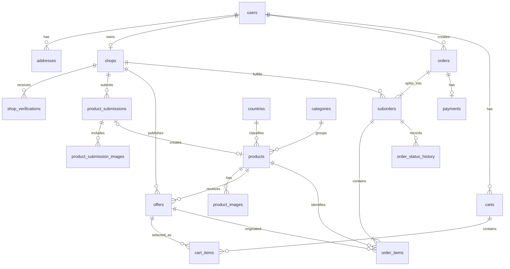

# Modelo lógico de datos — DeMiTierra

## 1. Objetivo

Este documento transforma el modelo conceptual de DeMiTierra en un modelo lógico preparado para su futura implementación en PostgreSQL.

Se definen:

* Tablas.
* Claves primarias.
* Claves foráneas.
* Columnas principales.
* Restricciones.
* Relaciones.
* Reglas de integridad.

Este documento todavía no contiene las sentencias SQL definitivas.

## 2. Convenciones

Se utilizarán las siguientes convenciones:

* Nombres de tablas y columnas en inglés.
* Formato `snake_case`.
* Claves primarias UUID.
* Fechas con zona horaria mediante `TIMESTAMPTZ`.
* Importes monetarios mediante `NUMERIC(12,2)`.
* Porcentajes mediante `NUMERIC(5,2)`.
* Cantidades y stock mediante `INTEGER`.
* Campos booleanos mediante `BOOLEAN`.
* Fechas de creación y actualización en las tablas principales.
* Borrado lógico o archivado cuando sea necesario conservar históricos.

Todas las tablas principales incluirán, cuando corresponda:

* `id`
* `created_at`
* `updated_at`

## 3. Tabla `users`

Representa las cuentas de acceso.

### Columnas

| Columna              | Tipo lógico  | Restricciones                     |
| -------------------- | ------------ | --------------------------------- |
| `id`                 | UUID         | Clave primaria                    |
| `first_name`         | VARCHAR(100) | Obligatorio                       |
| `last_name`          | VARCHAR(150) | Obligatorio                       |
| `email`              | VARCHAR(255) | Obligatorio y único               |
| `password_hash`      | VARCHAR(255) | Obligatorio                       |
| `preferred_language` | VARCHAR(10)  | Obligatorio                       |
| `role`               | ENUM         | `CUSTOMER`, `MERCHANT`, `ADMIN`   |
| `status`             | ENUM         | `ACTIVE`, `INACTIVE`, `SUSPENDED` |
| `email_verified`     | BOOLEAN      | Valor inicial `FALSE`             |
| `created_at`         | TIMESTAMPTZ  | Obligatorio                       |
| `updated_at`         | TIMESTAMPTZ  | Obligatorio                       |

### Reglas

* El correo electrónico será único.
* La contraseña nunca se almacenará en texto plano.
* Solo los usuarios con estado `ACTIVE` podrán iniciar sesión.
* El rol determinará los permisos principales.

## 4. Tabla `addresses`

Representa las direcciones guardadas por los clientes.

### Columnas

| Columna           | Tipo lógico  | Restricciones           |
| ----------------- | ------------ | ----------------------- |
| `id`              | UUID         | Clave primaria          |
| `user_id`         | UUID         | Clave foránea a `users` |
| `label`           | VARCHAR(100) | Ejemplo: Casa           |
| `recipient_name`  | VARCHAR(200) | Obligatorio             |
| `street`          | VARCHAR(200) | Obligatorio             |
| `street_number`   | VARCHAR(20)  | Obligatorio             |
| `additional_info` | VARCHAR(200) | Opcional                |
| `postal_code`     | VARCHAR(15)  | Obligatorio             |
| `city`            | VARCHAR(100) | Obligatorio             |
| `province`        | VARCHAR(100) | Obligatorio             |
| `country_code`    | VARCHAR(2)   | Obligatorio             |
| `is_default`      | BOOLEAN      | Valor inicial `FALSE`   |
| `created_at`      | TIMESTAMPTZ  | Obligatorio             |
| `updated_at`      | TIMESTAMPTZ  | Obligatorio             |

### Relaciones

* Un usuario puede tener varias direcciones.
* Cada dirección pertenece a un único usuario.

### Reglas

* Un usuario solo podrá tener una dirección predeterminada.
* En el MVP, las direcciones estarán inicialmente limitadas a Valencia.

## 5. Tabla `shops`

Representa los comercios registrados.

### Columnas

| Columna                | Tipo lógico   | Restricciones                 |
| ---------------------- | ------------- | ----------------------------- |
| `id`                   | UUID          | Clave primaria                |
| `owner_user_id`        | UUID          | Clave foránea única a `users` |
| `commercial_name`      | VARCHAR(200)  | Obligatorio                   |
| `legal_name`           | VARCHAR(250)  | Obligatorio                   |
| `tax_identifier`       | VARCHAR(50)   | Obligatorio y único           |
| `legal_representative` | VARCHAR(200)  | Opcional                      |
| `contact_email`        | VARCHAR(255)  | Obligatorio                   |
| `phone`                | VARCHAR(30)   | Obligatorio                   |
| `street`               | VARCHAR(200)  | Obligatorio                   |
| `street_number`        | VARCHAR(20)   | Obligatorio                   |
| `postal_code`          | VARCHAR(15)   | Obligatorio                   |
| `city`                 | VARCHAR(100)  | Obligatorio                   |
| `province`             | VARCHAR(100)  | Obligatorio                   |
| `food_registry_number` | VARCHAR(100)  | Opcional según actividad      |
| `delivery_zone`        | VARCHAR(250)  | Obligatorio                   |
| `delivery_fee`         | NUMERIC(12,2) | Mayor o igual que cero        |
| `minimum_order`        | NUMERIC(12,2) | Mayor o igual que cero        |
| `pickup_available`     | BOOLEAN       | Valor inicial `FALSE`         |
| `verification_status`  | ENUM          | Estado de verificación        |
| `is_active`            | BOOLEAN       | Valor inicial `FALSE`         |
| `created_at`           | TIMESTAMPTZ   | Obligatorio                   |
| `updated_at`           | TIMESTAMPTZ   | Obligatorio                   |

### Estados de verificación

* `DRAFT`
* `PENDING_VERIFICATION`
* `CHANGES_REQUIRED`
* `APPROVED`
* `REJECTED`
* `SUSPENDED`

### Reglas

* Cada comercio tendrá un usuario propietario.
* En el MVP, un usuario comerciante administrará como máximo un comercio.
* Solo los comercios `APPROVED` y activos podrán vender.
* El coste de envío y el pedido mínimo no podrán ser negativos.

## 6. Tabla `shop_verifications`

Almacena el historial de revisión de los comercios.

### Columnas

| Columna               | Tipo lógico | Restricciones           |
| --------------------- | ----------- | ----------------------- |
| `id`                  | UUID        | Clave primaria          |
| `shop_id`             | UUID        | Clave foránea a `shops` |
| `reviewed_by_user_id` | UUID        | Clave foránea a `users` |
| `previous_status`     | ENUM        | Estado anterior         |
| `new_status`          | ENUM        | Estado resultante       |
| `comments`            | TEXT        | Opcional                |
| `reviewed_at`         | TIMESTAMPTZ | Obligatorio             |

### Reglas

* El usuario revisor deberá tener rol `ADMIN`.
* Cada cambio de estado administrativo deberá generar un registro.
* El historial no se eliminará cuando cambie el estado del comercio.

## 7. Tabla `countries`

Representa los países o regiones disponibles en el catálogo.

### Columnas

| Columna          | Tipo lógico  | Restricciones        |
| ---------------- | ------------ | -------------------- |
| `id`             | UUID         | Clave primaria       |
| `name`           | VARCHAR(120) | Obligatorio y único  |
| `code`           | VARCHAR(10)  | Obligatorio y único  |
| `flag_image_key` | VARCHAR(500) | Opcional             |
| `is_active`      | BOOLEAN      | Valor inicial `TRUE` |
| `created_at`     | TIMESTAMPTZ  | Obligatorio          |
| `updated_at`     | TIMESTAMPTZ  | Obligatorio          |

### Ejemplos

* Colombia.
* Venezuela.
* Marruecos.

## 8. Tabla `categories`

Representa las categorías del catálogo.

### Columnas

| Columna       | Tipo lógico  | Restricciones        |
| ------------- | ------------ | -------------------- |
| `id`          | UUID         | Clave primaria       |
| `name`        | VARCHAR(120) | Obligatorio y único  |
| `slug`        | VARCHAR(140) | Obligatorio y único  |
| `description` | TEXT         | Opcional             |
| `is_active`   | BOOLEAN      | Valor inicial `TRUE` |
| `created_at`  | TIMESTAMPTZ  | Obligatorio          |
| `updated_at`  | TIMESTAMPTZ  | Obligatorio          |

### Ejemplos

* Galletas.
* Harinas.
* Bebidas.
* Condimentos.
* Conservas.

## 9. Tabla `products`

Representa las fichas maestras del catálogo.

### Columnas

| Columna              | Tipo lógico   | Restricciones                |
| -------------------- | ------------- | ---------------------------- |
| `id`                 | UUID          | Clave primaria               |
| `country_id`         | UUID          | Clave foránea a `countries`  |
| `category_id`        | UUID          | Clave foránea a `categories` |
| `name`               | VARCHAR(250)  | Obligatorio                  |
| `slug`               | VARCHAR(280)  | Obligatorio y único          |
| `brand`              | VARCHAR(150)  | Opcional                     |
| `description`        | TEXT          | Obligatorio                  |
| `ingredients`        | TEXT          | Opcional                     |
| `barcode`            | VARCHAR(50)   | Único cuando exista          |
| `net_quantity`       | NUMERIC(12,3) | Opcional                     |
| `unit`               | ENUM          | `G`, `KG`, `ML`, `L`, `UNIT` |
| `status`             | ENUM          | `ACTIVE`, `ARCHIVED`         |
| `created_by_user_id` | UUID          | Clave foránea a `users`      |
| `created_at`         | TIMESTAMPTZ   | Obligatorio                  |
| `updated_at`         | TIMESTAMPTZ   | Obligatorio                  |

### Reglas

* Un producto maestro no almacenará precio ni stock.
* El código de barras será único cuando esté disponible.
* Los productos archivados no aparecerán en nuevas búsquedas.
* Solo administradores podrán modificar directamente una ficha aprobada.

## 10. Tabla `product_images`

Representa las imágenes de los productos maestros.

### Columnas

| Columna         | Tipo lógico  | Restricciones              |
| --------------- | ------------ | -------------------------- |
| `id`            | UUID         | Clave primaria             |
| `product_id`    | UUID         | Clave foránea a `products` |
| `storage_key`   | VARCHAR(500) | Obligatorio                |
| `alt_text`      | VARCHAR(250) | Opcional                   |
| `display_order` | INTEGER      | Mayor o igual que cero     |
| `is_primary`    | BOOLEAN      | Valor inicial `FALSE`      |
| `status`        | ENUM         | `ACTIVE`, `ARCHIVED`       |
| `created_at`    | TIMESTAMPTZ  | Obligatorio                |

### Reglas

* Cada producto tendrá como máximo una imagen principal activa.
* PostgreSQL almacenará la clave del archivo, no la imagen.
* En AWS, `storage_key` identificará el objeto dentro de S3.

## 11. Tabla `product_submissions`

Representa las propuestas de nuevos productos enviadas por los comercios.

### Columnas

| Columna                 | Tipo lógico   | Restricciones                       |
| ----------------------- | ------------- | ----------------------------------- |
| `id`                    | UUID          | Clave primaria                      |
| `shop_id`               | UUID          | Clave foránea a `shops`             |
| `country_id`            | UUID          | Clave foránea a `countries`         |
| `category_id`           | UUID          | Clave foránea a `categories`        |
| `proposed_name`         | VARCHAR(250)  | Obligatorio                         |
| `proposed_brand`        | VARCHAR(150)  | Opcional                            |
| `proposed_description`  | TEXT          | Obligatorio                         |
| `proposed_ingredients`  | TEXT          | Opcional                            |
| `proposed_barcode`      | VARCHAR(50)   | Opcional                            |
| `proposed_net_quantity` | NUMERIC(12,3) | Opcional                            |
| `proposed_unit`         | ENUM          | Opcional                            |
| `status`                | ENUM          | Estado de revisión                  |
| `admin_comments`        | TEXT          | Opcional                            |
| `reviewed_by_user_id`   | UUID          | Clave foránea opcional a `users`    |
| `created_product_id`    | UUID          | Clave foránea opcional a `products` |
| `submitted_at`          | TIMESTAMPTZ   | Opcional                            |
| `reviewed_at`           | TIMESTAMPTZ   | Opcional                            |
| `created_at`            | TIMESTAMPTZ   | Obligatorio                         |
| `updated_at`            | TIMESTAMPTZ   | Obligatorio                         |

### Estados

* `DRAFT`
* `PENDING_REVIEW`
* `CHANGES_REQUESTED`
* `APPROVED`
* `REJECTED`

### Reglas

* Solo un comercio aprobado podrá enviar una propuesta.
* Una propuesta aprobada podrá generar un producto maestro.
* `created_product_id` permanecerá vacío hasta la aprobación.
* La aprobación deberá registrar qué administrador realizó la revisión.

## 12. Tabla `product_submission_images`

Representa las imágenes provisionales de una propuesta.

### Columnas

| Columna                 | Tipo lógico  | Restricciones          |
| ----------------------- | ------------ | ---------------------- |
| `id`                    | UUID         | Clave primaria         |
| `product_submission_id` | UUID         | Clave foránea          |
| `storage_key`           | VARCHAR(500) | Obligatorio            |
| `display_order`         | INTEGER      | Mayor o igual que cero |
| `is_primary`            | BOOLEAN      | Valor inicial `FALSE`  |
| `created_at`            | TIMESTAMPTZ  | Obligatorio            |

### Reglas

* Las imágenes permanecerán separadas de las imágenes oficiales hasta que se apruebe la propuesta.
* Después de la aprobación podrán copiarse o vincularse al producto maestro.

## 13. Tabla `offers`

Representa las condiciones comerciales de un producto en un comercio.

### Columnas

| Columna                      | Tipo lógico   | Restricciones                    |
| ---------------------------- | ------------- | -------------------------------- |
| `id`                         | UUID          | Clave primaria                   |
| `product_id`                 | UUID          | Clave foránea a `products`       |
| `shop_id`                    | UUID          | Clave foránea a `shops`          |
| `base_price`                 | NUMERIC(12,2) | Mayor que cero                   |
| `commission_percentage`      | NUMERIC(5,2)  | Entre 0 y 100                    |
| `final_price`                | NUMERIC(12,2) | Mayor que cero                   |
| `stock`                      | INTEGER       | Mayor o igual que cero           |
| `estimated_delivery_minutes` | INTEGER       | Mayor que cero                   |
| `pickup_available`           | BOOLEAN       | Valor inicial `FALSE`            |
| `review_status`              | ENUM          | Estado administrativo            |
| `availability_status`        | ENUM          | Estado comercial                 |
| `admin_comments`             | TEXT          | Opcional                         |
| `reviewed_by_user_id`        | UUID          | Clave foránea opcional a `users` |
| `reviewed_at`                | TIMESTAMPTZ   | Opcional                         |
| `created_at`                 | TIMESTAMPTZ   | Obligatorio                      |
| `updated_at`                 | TIMESTAMPTZ   | Obligatorio                      |

### Estados de revisión

* `PENDING_REVIEW`
* `CHANGES_REQUESTED`
* `APPROVED`
* `REJECTED`
* `ARCHIVED`

### Estados de disponibilidad

* `AVAILABLE`
* `OUT_OF_STOCK`
* `PAUSED`

### Reglas

* Un comercio no tendrá dos ofertas activas para el mismo producto.
* Solo las ofertas `APPROVED` y `AVAILABLE` serán visibles.
* El stock no podrá ser negativo.
* El precio final deberá corresponder al precio base más la comisión.
* En el MVP se guardará `final_price` para simplificar consultas, pero se validará su cálculo en el backend.

### Restricción de unicidad

La combinación deberá ser única:

```text
shop_id + product_id
```

## 14. Tabla `carts`

Representa los carritos de compra.

### Columnas

| Columna      | Tipo lógico | Restricciones           |
| ------------ | ----------- | ----------------------- |
| `id`         | UUID        | Clave primaria          |
| `user_id`    | UUID        | Clave foránea a `users` |
| `status`     | ENUM        | Estado del carrito      |
| `created_at` | TIMESTAMPTZ | Obligatorio             |
| `updated_at` | TIMESTAMPTZ | Obligatorio             |

### Estados

* `ACTIVE`
* `CONVERTED`
* `ABANDONED`

### Reglas

* Cada cliente tendrá como máximo un carrito `ACTIVE`.
* Un carrito convertido no podrá seguir modificándose.

## 15. Tabla `cart_items`

Representa las ofertas añadidas al carrito.

### Columnas

| Columna      | Tipo lógico | Restricciones            |
| ------------ | ----------- | ------------------------ |
| `id`         | UUID        | Clave primaria           |
| `cart_id`    | UUID        | Clave foránea a `carts`  |
| `offer_id`   | UUID        | Clave foránea a `offers` |
| `quantity`   | INTEGER     | Mayor que cero           |
| `created_at` | TIMESTAMPTZ | Obligatorio              |
| `updated_at` | TIMESTAMPTZ | Obligatorio              |

### Reglas

* Una oferta solo aparecerá una vez dentro del mismo carrito.
* Si el cliente vuelve a añadirla, se actualizará la cantidad.
* El precio y el stock deberán comprobarse nuevamente al confirmar el pedido.

### Restricción de unicidad

```text
cart_id + offer_id
```

## 16. Tabla `orders`

Representa la compra completa del cliente.

### Columnas

| Columna                    | Tipo lógico   | Restricciones           |
| -------------------------- | ------------- | ----------------------- |
| `id`                       | UUID          | Clave primaria          |
| `user_id`                  | UUID          | Clave foránea a `users` |
| `order_number`             | VARCHAR(40)   | Obligatorio y único     |
| `status`                   | ENUM          | Estado general          |
| `delivery_recipient_name`  | VARCHAR(200)  | Obligatorio             |
| `delivery_street`          | VARCHAR(200)  | Obligatorio             |
| `delivery_street_number`   | VARCHAR(20)   | Obligatorio             |
| `delivery_additional_info` | VARCHAR(200)  | Opcional                |
| `delivery_postal_code`     | VARCHAR(15)   | Obligatorio             |
| `delivery_city`            | VARCHAR(100)  | Obligatorio             |
| `delivery_province`        | VARCHAR(100)  | Obligatorio             |
| `products_amount`          | NUMERIC(12,2) | Mayor o igual que cero  |
| `commission_amount`        | NUMERIC(12,2) | Mayor o igual que cero  |
| `delivery_amount`          | NUMERIC(12,2) | Mayor o igual que cero  |
| `total_amount`             | NUMERIC(12,2) | Mayor o igual que cero  |
| `created_at`               | TIMESTAMPTZ   | Obligatorio             |
| `updated_at`               | TIMESTAMPTZ   | Obligatorio             |

### Estados

* `PENDING_PAYMENT`
* `CONFIRMED`
* `PARTIALLY_COMPLETED`
* `COMPLETED`
* `CANCELLED`

### Reglas

* La dirección de entrega se copiará dentro del pedido.
* Los importes históricos no dependerán de valores actuales.
* El total será la suma de productos, comisiones y envíos.

## 17. Tabla `suborders`

Representa la parte del pedido asignada a un comercio.

### Columnas

| Columna                      | Tipo lógico   | Restricciones            |
| ---------------------------- | ------------- | ------------------------ |
| `id`                         | UUID          | Clave primaria           |
| `order_id`                   | UUID          | Clave foránea a `orders` |
| `shop_id`                    | UUID          | Clave foránea a `shops`  |
| `suborder_number`            | VARCHAR(50)   | Obligatorio y único      |
| `status`                     | ENUM          | Estado del subpedido     |
| `products_amount`            | NUMERIC(12,2) | Mayor o igual que cero   |
| `commission_amount`          | NUMERIC(12,2) | Mayor o igual que cero   |
| `delivery_amount`            | NUMERIC(12,2) | Mayor o igual que cero   |
| `total_amount`               | NUMERIC(12,2) | Mayor o igual que cero   |
| `estimated_delivery_minutes` | INTEGER       | Opcional                 |
| `created_at`                 | TIMESTAMPTZ   | Obligatorio              |
| `updated_at`                 | TIMESTAMPTZ   | Obligatorio              |

### Estados

* `RECEIVED`
* `PREPARING`
* `SHIPPED`
* `DELIVERED`
* `CANCELLED`

### Reglas

* Cada comercio tendrá como máximo un subpedido por pedido principal.
* Un comercio solo podrá modificar sus propios subpedidos.
* El coste de envío se almacenará en el subpedido.

### Restricción de unicidad

```text
order_id + shop_id
```

## 18. Tabla `order_items`

Representa los artículos históricos de un subpedido.

### Columnas

| Columna            | Tipo lógico   | Restricciones                       |
| ------------------ | ------------- | ----------------------------------- |
| `id`               | UUID          | Clave primaria                      |
| `suborder_id`      | UUID          | Clave foránea a `suborders`         |
| `offer_id`         | UUID          | Clave foránea opcional a `offers`   |
| `product_id`       | UUID          | Clave foránea opcional a `products` |
| `product_name`     | VARCHAR(250)  | Obligatorio                         |
| `shop_name`        | VARCHAR(200)  | Obligatorio                         |
| `quantity`         | INTEGER       | Mayor que cero                      |
| `base_unit_price`  | NUMERIC(12,2) | Mayor o igual que cero              |
| `unit_commission`  | NUMERIC(12,2) | Mayor o igual que cero              |
| `final_unit_price` | NUMERIC(12,2) | Mayor o igual que cero              |
| `line_total`       | NUMERIC(12,2) | Mayor o igual que cero              |
| `created_at`       | TIMESTAMPTZ   | Obligatorio                         |

### Reglas

* Los nombres y precios se copiarán al realizar la compra.
* La eliminación o archivado de una oferta no eliminará el artículo histórico.
* `line_total` será igual a `final_unit_price × quantity`.

## 19. Tabla `order_status_history`

Representa los cambios de estado de cada subpedido.

### Columnas

| Columna              | Tipo lógico | Restricciones                  |
| -------------------- | ----------- | ------------------------------ |
| `id`                 | UUID        | Clave primaria                 |
| `suborder_id`        | UUID        | Clave foránea a `suborders`    |
| `changed_by_user_id` | UUID        | Clave foránea a `users`        |
| `previous_status`    | ENUM        | Opcional en el primer registro |
| `new_status`         | ENUM        | Obligatorio                    |
| `comment`            | TEXT        | Opcional                       |
| `created_at`         | TIMESTAMPTZ | Obligatorio                    |

### Reglas

* Cada cambio de estado deberá generar un registro.
* El historial no podrá editarse desde la aplicación.
* El cliente podrá consultar esta información como seguimiento.

## 20. Tabla `payments`

Representa el pago del pedido.

### Columnas

| Columna              | Tipo lógico   | Restricciones                  |
| -------------------- | ------------- | ------------------------------ |
| `id`                 | UUID          | Clave primaria                 |
| `order_id`           | UUID          | Clave foránea única a `orders` |
| `external_reference` | VARCHAR(200)  | Opcional                       |
| `method`             | ENUM          | Método de pago                 |
| `status`             | ENUM          | Estado del pago                |
| `amount`             | NUMERIC(12,2) | Mayor o igual que cero         |
| `processed_at`       | TIMESTAMPTZ   | Opcional                       |
| `created_at`         | TIMESTAMPTZ   | Obligatorio                    |
| `updated_at`         | TIMESTAMPTZ   | Obligatorio                    |

### Métodos iniciales

* `SIMULATED_CARD`
* `TEST_GATEWAY`

### Estados

* `PENDING`
* `APPROVED`
* `FAILED`
* `CANCELLED`
* `REFUNDED`

### Reglas

* Cada pedido tendrá como máximo un pago principal en el MVP.
* El importe del pago deberá coincidir con el total del pedido.
* No se almacenarán números reales de tarjetas.

## 21. Relaciones principales

```text
users
├── addresses
├── shops
├── orders
└── carts

shops
├── shop_verifications
├── product_submissions
├── offers
└── suborders

products
├── product_images
├── offers
└── order_items

orders
├── suborders
└── payments

suborders
├── order_items
└── order_status_history
```

## 22. Diagrama lógico simplificado



## 23. Restricciones de unicidad

Se definirán restricciones para evitar duplicidades:

* `users.email`
* `shops.tax_identifier`
* `shops.owner_user_id`
* `countries.name`
* `countries.code`
* `categories.name`
* `categories.slug`
* `products.slug`
* `products.barcode`, cuando exista
* `offers(shop_id, product_id)`
* `cart_items(cart_id, offer_id)`
* `suborders(order_id, shop_id)`
* `orders.order_number`
* `suborders.suborder_number`
* `payments.order_id`

## 24. Índices iniciales previstos

Se crearán índices para las consultas más frecuentes:

* Productos por país.
* Productos por categoría.
* Productos por nombre.
* Ofertas por producto.
* Ofertas por comercio.
* Ofertas aprobadas y disponibles.
* Pedidos por cliente.
* Subpedidos por comercio.
* Subpedidos por estado.
* Propuestas pendientes de revisión.
* Comercios pendientes de verificación.

## 25. Política de eliminación

No toda la información se eliminará físicamente.

### Se archivarán

* Productos.
* Ofertas.
* Comercios.
* Imágenes.

### Se conservarán

* Pedidos.
* Artículos de pedidos.
* Pagos.
* Historiales de estado.
* Historiales de verificación.

Esto garantiza trazabilidad y evita romper relaciones históricas.

## 26. Decisiones pendientes para el modelo físico

En el siguiente paso deberán definirse:

* Tipos ENUM o tablas de referencia.
* Extensión PostgreSQL para generación de UUID.
* Sentencias `CREATE TABLE`.
* Restricciones `CHECK`.
* Acciones `ON DELETE`.
* Índices concretos.
* Migraciones con Alembic.
* Estrategia de actualización automática de `updated_at`.
